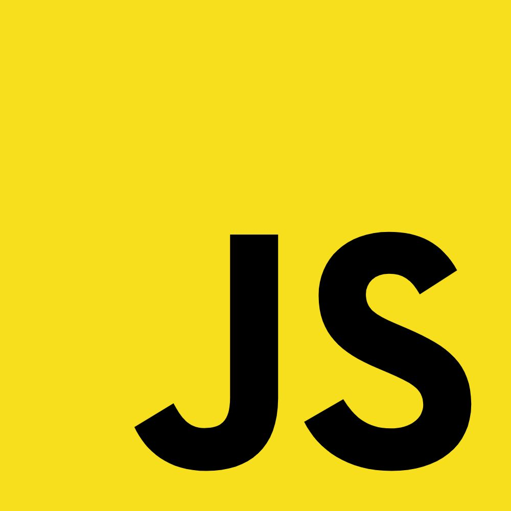

---

## Stacks used

  
  
  
  
  
  

## About the project

This is my portfolio which is already online at https://fullstacker.com.br. Some libraries were used to create the carousels: React-responsive-carousel and React-Multi-Carousel.

## The use os web scapers

The articles here presented were all written at Linkedin but to get all the data for the thumbnails, a web scrapper had to be developed since Linkedin doesn't have an API to do it. It's important to say that only MY PUBLIC content is being fetched.

